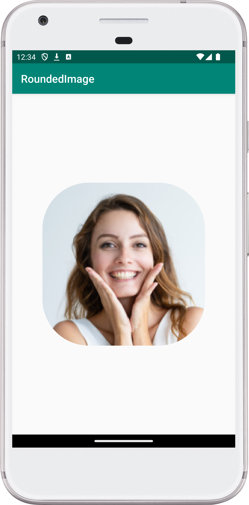

[](https://stand-with-ukraine.pp.ua)


# RoundedImageView Sample

This sample demonstrates how to create a custom ImageView that displays images
with rounded corners.

## Value:

This project provides a clear and concise example of:

- Creating a custom View by extending AppCompatImageView.
- Overriding the `setImageDrawable()` method to modify the displayed image.
- Using RoundedBitmapDrawableFactory to create a rounded bitmap.
- Applying the custom View in a layout XML file.
  This sample can be used as a starting point for creating more complex custom
  Views or for learning about image manipulation in Android.

## Usage:

To use the RoundedImageView, simply add it to your layout XML file:

```xml

<ua.turskyi.roundedimage.RoundedImageView android:id="@+id/image"
    android:layout_width="wrap_content" android:layout_height="wrap_content"
    app:layout_constraintBottom_toBottomOf="parent"
    app:layout_constraintLeft_toLeftOf="parent"
    app:layout_constraintRight_toRightOf="parent"
    app:layout_constraintTop_toTopOf="parent"
    android:src="@drawable/pic_profile" />
```

You can then set the image source using the src attribute or programmatically
using `setImageResource()`.

## Contact:

For any inquiries or suggestions, please open an issue on the GitHub repository
or reach out to me directly at
[dmytro@turskyi.com](mailto:dmytro@turskyi.com).

## Screenshot:

<!--suppress CheckImageSize -->
